# MyNotes — Android-приложение коллективного ведения заметок

MyNotes — это мобильное приложение для создания, просмотра, редактирования и совместного использования заметок. Поддерживает группы, Markdown-разметку, теги, файлы и поиск. В данной реализации данные хранятся в Firebase - Firestore и синхронизируются в реальном времени между пользователями.

## Возможности ##

- Авторизация пользователя (выбор из списка)
- Заметки объединяются в группы
- CRUD-операции над заметками и группа
- Прикрепление изображений и файлов к заметкам
- Теги
- Markdown-разметка заметок
- Поиск по заголовкам, тегам и содержимому
- Работа в реальном времени через Firebase
- Полностью реализовано на Java в Android Studio
- Минимальные требования Android 4.2

## Развертывание приложения - Настройка Firebase ##
На сайте  добавим проект с именем MyNotes. Далее соглашаемся с условиями, Google Analytics можно отключить, т.к. она не требуется в рамках данного проекта. Далее необходимо добавить приложение com.dorofeev.mynotes и загрузить конфигурационный файл google-services.json. Далее следуя инструкциям необходимо подключить необходимые библиотеки к проекту.

## Настройка пользователей ##
Все данные о пользователях хранятся в облачной базе данных Firebase Firestore. Пользователи задаются заранее.
Для реализации механизма совместного доступа создадим коллекцию пользователей “users”, с одним полем тип String – username:
 
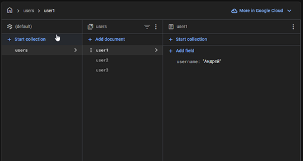

*Коллекция users в Firestore*

В неё добавим трех пользователей со следующими полями:
“Document ID” – user1, user2, user3. Для каждого из пользователей созда-дим записи:
 
 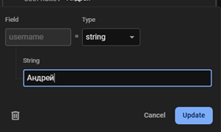

*Ввод имени пользователя в Firestore*

# Работа с приложением

При запуске приложения отображается экран входа:

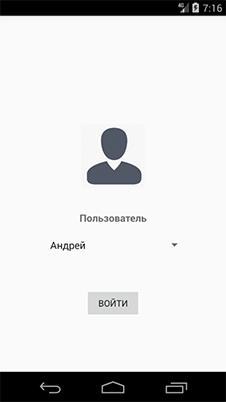
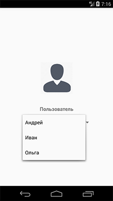

*Экран входа в приложение.*

После запуска приложения открывается экран выбора пользователя. Приложение автоматически загружает список доступных аккаунтов из Firebase Firestore и отображает их в выпадающем списке. Выберите нужного пользователя и нажмите кнопку «Войти».
Если список пользователей пуст или не удалось подключиться к базе данных, вы увидите сообщение об ошибке. После успешного входа вы будете перенаправлены на главный экран с группами и заметками.

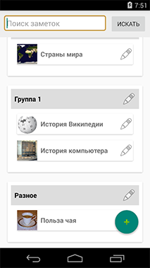
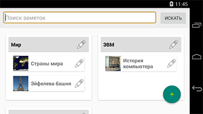

## Основной экран приложения ##

Элементы интерфейса автоматически адаптируются под вертикальную и горизонтальную ориентацию экрана.
В верхней части экрана находится строка поиска и кнопка “Искать”. Пользователь может ввести ключевое слово, и по нажатию на кнопку будет выполнен поиск по:
- заголовкам заметок;
- содержимому (Markdown);
- тегам.

Основное пространство занимает список групп. Каждая группа отображается в виде карточки с:
- названием группы;
- кнопкой  для редактирования/удаления группы.

Внутри каждой группы находится список заметок. Которые отображаются как карточки заметок, включающие:
- заголовок заметки;
- миниатюру изображения (если указано);
- кнопку  для редактирования заметки;

## Кнопка создания группы или заметки ##

Внизу экрана расположена кнопка , открывающая меню с двумя действиями:
- Создать группу — доступно всегда;
- Создать заметку — доступно только при наличии хотя бы одной группы.

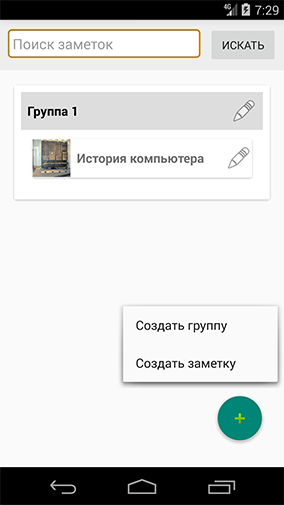

*Меню создания группы или заметки*

## Создать и изменить группу  ##

При нажатии создать группу появляется диалоговое окно:

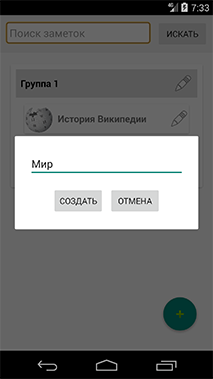

*создать группу.*

Необходимо ввести имя группы и нажать «создать», кнопка «отмена» отменяет операцию и не создает группу.
Если нажать на основном экране кнопку  у названия группы, отобразится диалог редактирования группы.

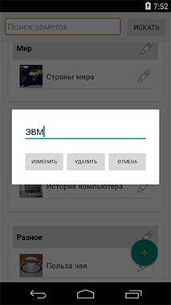

*редактировать группу.*

Если необходимо изменить название – нужно нажать кнопку  на против заголовка. Появится диалог редактирования группы, ввести новое и нажать кнопку «изменить», если нужно удалить группу, то нажать кнопку «удалить». При удалении отобразится следующий диалог:

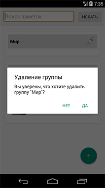

*Запрос удаления группы.*

**Внимание**, удаление группы приведет к удалению всех вложенных заметок.

## Создать и изменить заметку  ##

При нажатии пункта меню «создать заметку» появится следующий экран:

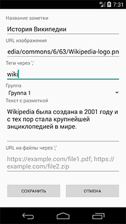

*Создать заметку.*

Тут необходимо ввести название заметки, URL изображения, тэги, выбрать группу, написать текст с разметкой. указать файлы. В программе использована библиотека Markwon для отображения текста в формате Markdown основные возможности:
- заголовки (\#, \#\#, \#\#\#);
- жирный (\*\*текст\*\*) и курсив (\*текст\*);
- списки (\-, \*);
- цитаты (\>);
- кодовые блоки (\`\`\`);
- изображения и ссылки \(\!\[alt\]\(url\) / \[текст\]\(ссылка\)\).

Более подробно с работой библиотеки можно ознакомиться на [официальном сайте Markwon](https://noties.io/Markwon)

Изменение группы заметки:

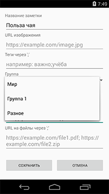
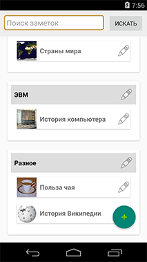

*Выбор группы заметки и результат*

Доступные группы отображаются в раскрывающемся списке. 
Для того чтобы сохранить заметку необходимо нажать кнопку «сохранить», если не нужно создавать заметку «отмена» - все данные не будут сохранены.

Рядом с каждой заметкой в группе расположена кнопка редактировать . При нажатии пользователь попадает на экран редактирования.

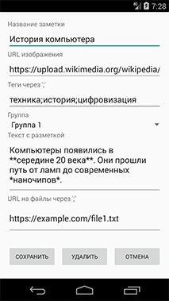

*Редактирование заметки*

Остальной функционал полностью идентичен: поля ввода, выпадающий список групп, кнопки «сохранить» и «отмена». Отличие - добавлена кнопка «удалить» - при нажатии будет отображен диалог удаления.

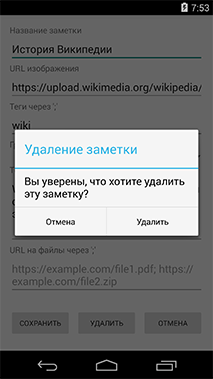

*Удаление заметки*

При нажатии «удалить» произойдет удаление заметки. При нажатии «отмена» удаление заметки не произойдет.

## Просмотр заметки ##
На основном экране при нажатии на заметке она будет отображена в режиме просмотра:

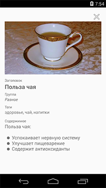
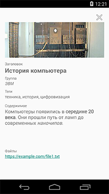

*Варианты просмотра заметок*

В данном режиме текст отображается с форматированием изображение увеличено, файлы отображаются кликабельными ссылками.

## Поиск заметок ##

Поиск заметок осуществляется вводом запроса в верхней строке основного экрана приложения и нажатием кнопки поиск:

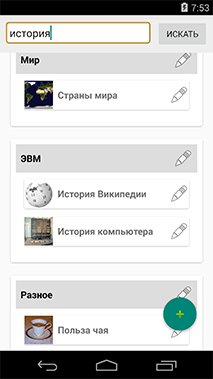
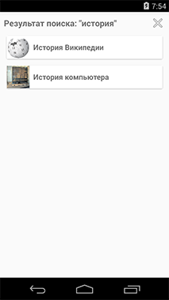

*Поиск по заголовкам.*

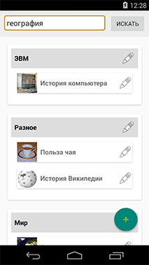
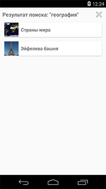

*Поиск по тэгам.*

# Ограничения работы приложения #

Минимальная поддерживаемая версия Android — 4.2
На Android 4.2 приложение запускается, но не работает с Firebase, так как:
- Отсутствует поддержка TLS 1.2, требуемого с 2021 года для соединения с Firebase. Требуется Android 4.4/

Ограничения бесплатного тарифа Firebase:
- Можно использовать только ссылки на файлы и изображения;
- Хранилище файлов (Firebase Storage) требует привязки банковской карты — иначе недоступно.
- Есть ограничение по числу операций в БД в сутки и объему данных

Изображения и файлы:
- Android 4.4 и ниже не отображает изображения по HTTPS с современными сертификатами (например, Let's Encrypt);
- Работают только ссылки с устаревшими сертификатами, либо по HTTP (что не рекомендуется). 